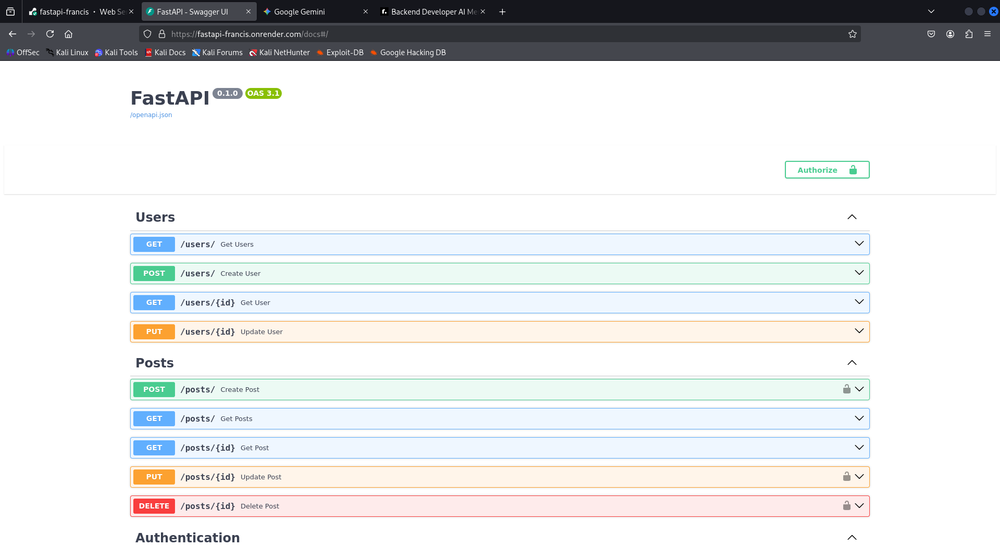
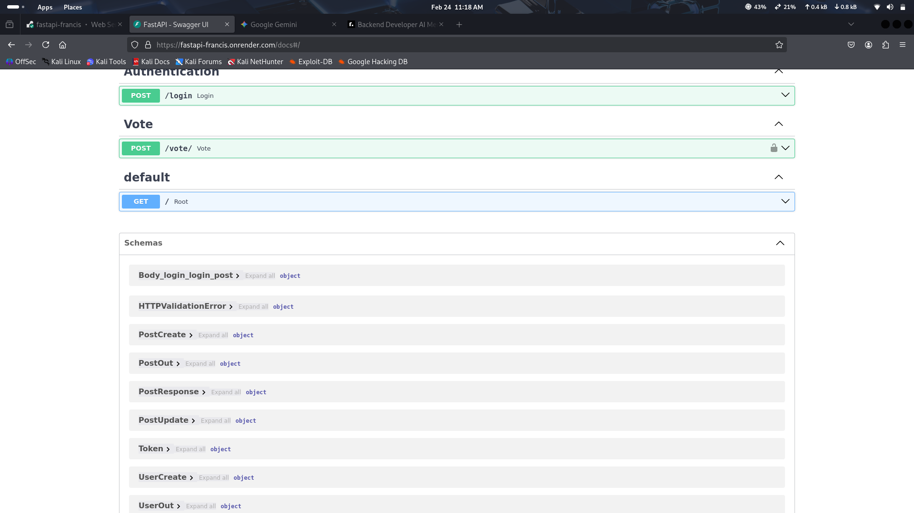
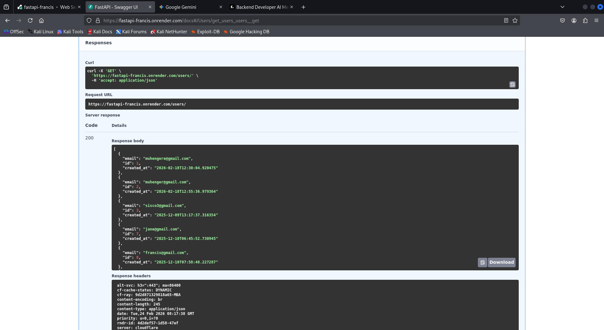
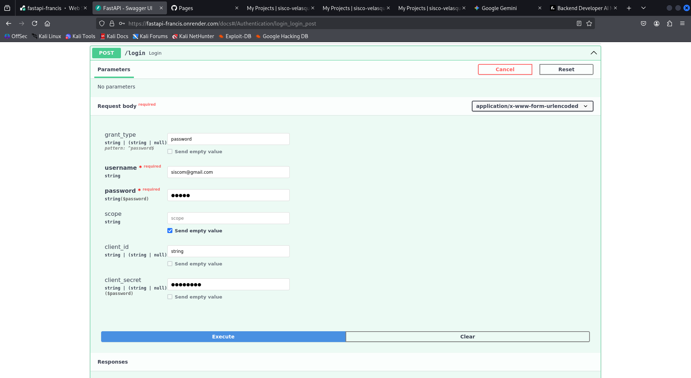
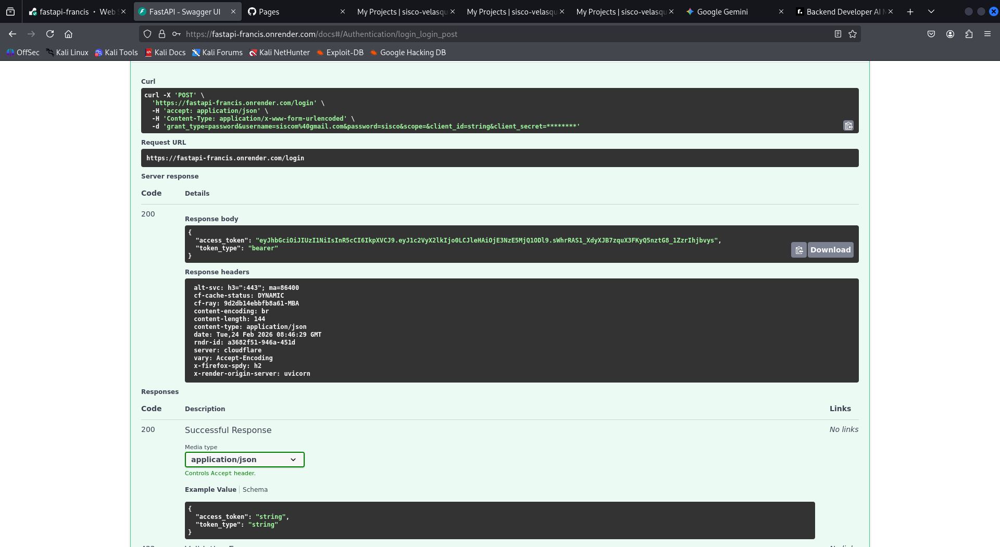
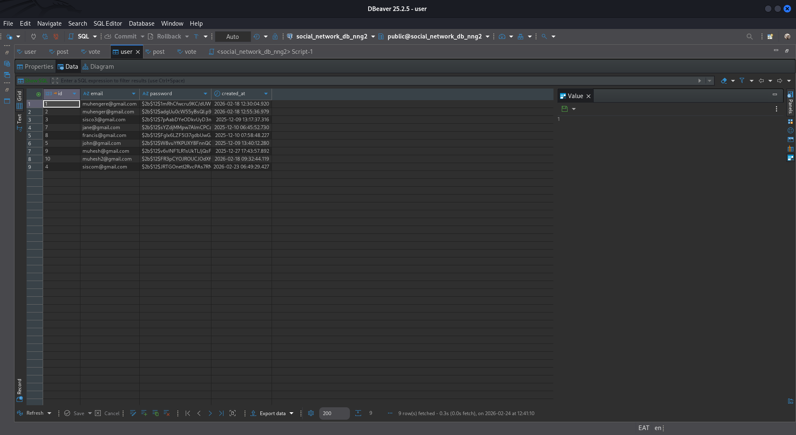
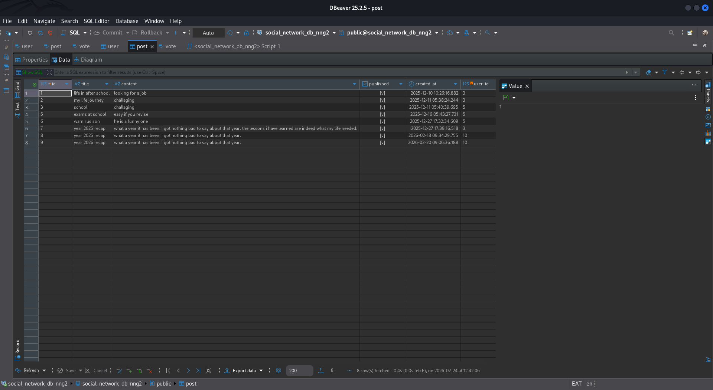

#  Detailed information about my Project 

[← Back to Home](index)

---

## 1. Social Network API (FastAPI)
**The Challenge:** Building a scalable backend that handles user interactions while maintaining high security. modification of database structure after it already has data.managment of man to many relationships.

* **Database Design:** Implemented a Many-to-Many relationship for the voting system using SQLModel.
* **Security:** Developed JWT-based authentication and password hashing with Bcrypt.
* **Documentation:** Integrated Swagger UI for interactive API testing.
* **Database Design:** Implemented a Many-to-Many relationship...

## swager ui of diffrent end points

## get users endpoint

## login endpoint

## database(user table)

## database(post table)

* **Check it out:** [GitHub Repository](https://github.com/sisco-velasquez/fastapi)

---

## 2. Dafpp Supermarket App
**The Challenge:** Creating a mobile solution for real-time inventory and order tracking.

* **Platform:** Android (Java).
* **Key Feature:** Admin dashboard for managing orders and user login timeout security.
* **Check it out:** [GitHub Repository](https://github.com/sisco-velasquez/Dafpp)

---

## 3. Academic Research & Networking
As a student at DeKUT, I am exploring the intersections of debt financing and hospital performance, alongside building robust networking solutions on Kali Linux.
